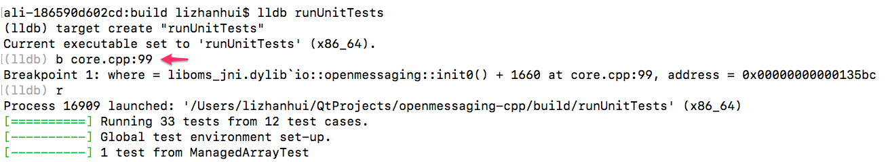
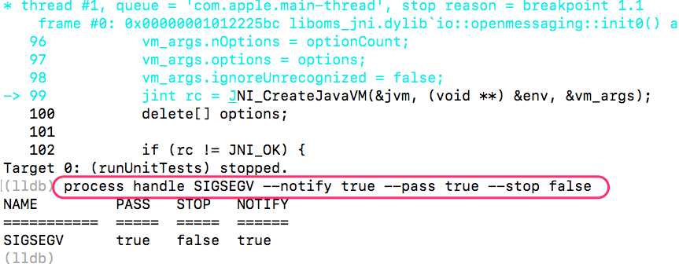

# Development Guide

## Prerequisites
The following softwares are assumed installed in your operating system.

1. Git
2. C++ Tool chain
3. CMake 3.x

## Build & Install Boost
This client SDK contains two parts: Open Messaging Specification Interfaces described in C++ and an implemetnation taking advantage of Java Native Interface Invocation API. The former is set of pure abstract classes; while the latter requires Java JNI library and several Boost component libraries which are statically linked against our shared library. Boost libraries are not required for end developers.

As a result, we need to install JDK and Boost when participating development.

Installation of JDK is nothing special: following guidelines from Oracle suffices. Remember to set JAVA_HOME environment variable.

Installing boost, however, requires attention due to most of pre-built static binaries from package managers are too old and many components are missing. We, hence, need to build and install from source code. Considering boost binaries will be part of our shared library, it must be built with "-fPIC" flag set.

The following commands can be referred to when compiling:

```sh
BOOST=boost_1_67_0

if [ ! -d ${HOME}/${BOOST} ]; then
    wget -O ${HOME}/boost_1_67_0.tar.gz https://dl.bintray.com/boostorg/release/1.67.0/source/boost_1_67_0.tar.gz
    tar -xzf ${HOME}/boost_1_67_0.tar.gz -C ${HOME}
fi

cd ${HOME}/${BOOST}

./bootstrap.sh --prefix=/usr/local --with-libraries=system,filesystem,chrono,thread,date_time

sudo   ./bjam cflags="-fPIC" cxxflags="-fPIC" link=static \
       --with-system --with-thread --with-date_time --with-filesystem --with-chrono  \
       -a install \
       > ${HOME}/build.log

```


## Anatomy of Repository

${workspace}/include contains all header files that defines interfaces of Open Messaging Specification.

${workspace}/sdk contains an implementation of Open Messaging Specification, taking advantage of Java Native Interface Invocation APIs.

${workspace}/tests contains unit test cases of the implementation.

${workspace}/third_party contains Google gtest, Google benchmark and a slim JRE.

## Build from Command Line

Build from command line is rather straightforward. Following CMake standard build process is fine. One suggestion is well worth of pointing out: use dedicated folder to build instead of nesting with original source folder.

```sh
cd ${workspace}
mkdir build
cd build
cmake ..
make 
```

To execute all test cases, `./runUnitTests`

### Debug using GDB/LLDB
To debug a process with JVM embeded, we need to supress SIGSEGV signal which is used by Java Virtual Machine for various scenarios. To achieve this, we need set breakpoint before launching embeded virtual machine. For our code,



After this, we may debug as we daily debug!


## Build and Develop in Clion

Clion has very good support of projects managed by CMake. Clone the source code and import directly into CLion workspace. Enjoy developing.

## Build and Develop in Qt Creator

## Build and Develop in Visual Studio Code